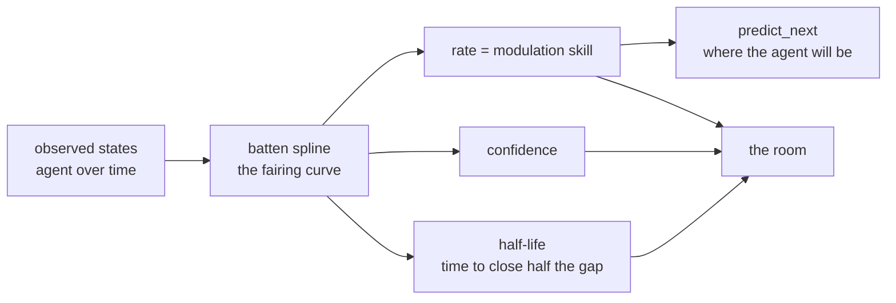

# batten-spline

Distance-weighted interpolation for cascade routing in AI systems.

`batten-spline` answers a practical question: *for this prompt, can my cheap local model handle it, or should I send it to a bigger cloud model?*  It treats verified outcomes as **battens** (anchor posts) in an embedding-space map.  Between battens, the model's capability is unknown — fog-of-war — so confidence is interpolated from nearby anchors.

The result is a small, stateful, self-improving router that works for any problem where you can represent prompts as vectors and record the quality of each routing choice.

---

## Quick start

```bash
pip install batten-spline
batten-spline demo
```

```python
import numpy as np
from batten_spline import CascadeRouter

router = CascadeRouter()

# Record some verified outcomes from a local model evaluation.
router.report_outcome(np.array([0.1, -0.2, 0.0]), quality=0.92)
router.report_outcome(np.array([0.2, -0.1, 0.1]), quality=0.88)
router.report_outcome(np.array([5.0,  2.0, -1.0]), quality=0.15)

# Route a new prompt.
result = router.route(np.array([0.15, -0.18, 0.05]))
print(result.target)      # LOCAL
print(result.confidence)  # ~0.9
print(result.fog_density) # small: near known territory
```

---

## The math

A **batten** is a tuple $(x_i, q_i, t_i)$ where

- $x_i \in \mathbb{R}^d$ is the prompt embedding,
- $q_i \in [0, 1]$ is the measured quality of the chosen route,
- $t_i$ is when the batten was observed.

For a new prompt embedding $x$, the router computes three quantities:

### 1. Age weight

Recent feedback matters more than stale feedback:

$$
a_i(t) = 0.5^{(t - t_i) / \tau}
$$

where $\tau$ is the `half_life` in seconds.  After one half-life, a batten's influence drops to 50%.

### 2. Distance weight

Nearby battens matter more than distant ones.  We use a Gaussian (RBF) kernel:

$$
d_i(x) = \|x - x_i\|_2
$$

$$
w_i(x, t) = a_i(t) \, \exp\!\left(-\frac{d_i(x)^2}{2\sigma^2}\right)
$$

The parameter $\sigma$ is the `fog_scale`.  Small $\sigma$ means confidence falls off quickly in unexplored territory; large $\sigma$ means distant battens still have a say.

### 3. Confidence estimate

The final estimate is a weighted average of observed qualities — a
[Nadaraya–Watson](https://en.wikipedia.org/wiki/Kernel_regression) estimator with exponential temporal decay:

$$
\hat{q}(x, t) = \frac{\sum_i w_i(x, t) \, q_i}{\sum_i w_i(x, t)}
$$

If no battens exist, $\hat{q} = 0$ (total fog).

### Fog density

Fog density is the distance to the nearest batten:

$$
\text{fog}(x) = \min_i \|x - x_i\|_2
$$

High fog density means the prompt is far from anything the router has seen before, so the confidence estimate should be treated with extra skepticism.

---

## Routing policy

By default, confidence maps to three cascade targets:

| Confidence               | Target    | Meaning                                           |
|--------------------------|-----------|---------------------------------------------------|
| $\hat{q} \ge 0.7$        | `LOCAL`   | Local model is reliable here.                     |
| $0.3 \le \hat{q} < 0.7$  | `CASCADE` | Try local first; escalate to cloud if it falters. |
| $\hat{q} < 0.3$          | `CLOUD`   | Unfamiliar or hard; go straight to cloud.         |

Thresholds and target names are fully configurable, so the router is not tied to a local/cloud dichotomy.  You can route between any set of models or strategies.

---

## Learning loop

```python
result = router.route(embedding)

# ... run the chosen model and measure real quality ...
actual_quality = measure(embedding, result.target)

# Add the new batten. The spline grows and future routes improve.
router.report_outcome(embedding, quality=actual_quality)
```

Use `router.spline.prune(max_battens=500)` to keep memory bounded by dropping the stalest battens.

---

## Command-line interface

```bash
# Demo with synthetic embeddings
batten-spline demo

# Route a single embedding
batten-spline route '[0.1, -0.2, 0.0, 0.4]'

# Route with a saved battens file and custom thresholds
batten-spline route '[0.0, 0.0]' \
    --battens battens.json \
    --fog-scale 1.5 \
    --local 0.75 \
    --cascade 0.25
```

A battens JSON file looks like this:

```json
{
  "battens": [
    {"embedding": [0.1, -0.2], "quality": 0.92, "metadata": {"source": "eval-1"}},
    {"embedding": [5.0, 2.0],  "quality": 0.12, "metadata": {"source": "eval-2"}}
  ]
}
```

---

## Serialization

```python
import json

state = router.state_dict()
with open("router.json", "w") as f:
    json.dump(state, f)

# Later...
with open("router.json") as f:
    restored = CascadeRouter.from_state_dict(json.load(f))
```

---

## When to use this

- Routing prompts between a local LLM and a cloud API.
- Choosing between a fast small model and a slow large model.
- Any embedding-based classification or gating problem where you can record outcomes.

The only requirements are:

1. A vector representation of each prompt.
2. A scalar quality score in `[0, 1]` for each routing outcome.

---

## Comparison with alternatives

| Approach | Pros | Cons |
|----------|------|------|
| **batten-spline** | Self-improving, stateful, temporal decay, no training step, works with any embedding | Requires quality feedback loop; O(n) per query (no indexing) |
| **Fixed threshold** (confidence > 0.7 → local) | Dead simple, zero state | Can't adapt to new prompts; no learning; ignores prompt similarity |
| **Trained classifier** (MLP on embeddings → route) | Fast inference, learns complex patterns | Needs labeled training data; can't forget stale patterns; no uncertainty |
| **Embedding cache / exact match** | Instant lookup, zero ambiguity | Only works for previously seen prompts; no generalization |
| **Bandit algorithms** (UCB, Thompson sampling) | Optimal exploration/exploitation tradeoff | Complex to implement; needs many rounds to converge; harder to debug |

### When batten-spline shines

- You have a **quality feedback signal** (human rating, eval score, downstream metric)
- Prompts arrive as **embeddings** (from any encoder — sentence-transformers, OpenAI, local model)
- You want **graceful degradation** (smooth confidence drop in unfamiliar regions rather than hard classifier boundaries)
- You need **temporal relevance** (recent feedback matters more than old data)
- You want something **simple and auditable** (no black-box model — just weighted averages)

### When something else is better

- You have massive labeled datasets → train a real classifier
- You need sub-millisecond latency with thousands of battens → add approximate nearest-neighbor indexing (ANN)
- You need multi-armed bandit optimality → use a proper bandit framework
- Embeddings are not available → use rule-based or LLM-based routing

## Acclimation fit — the batten through an agent's warming

> *You don't make the shape. You let it out.* — the shipwright's line, and
> the whole method: observed states are battens, and the fairing curve they
> let out is the agent's character.

Cross-pollinated from the elephant: a newcomer warms to a room — quickly
or slowly depending on experience, talent, and training at modulating
their vibe toward the room.  That modulation skill is the rate of an
exponential relaxation.  `fit_acclimation` bends a batten spline through an
agent's *observed states* in a room and reads the skill back:



<p align="center">
  
</p>

```python
import numpy as np
from batten_spline import fit_acclimation, predict_next, skill_from_curve

room  = np.array([0.55, 0.6, 0.5, 0.45, 0.5, 0.5, 0.5])
start = np.array([0.1, 0.2, 0.15, 0.3, 0.25, 0.2, 0.2])
t = np.linspace(0.0, 10.0, 12)
states = room + np.outer(np.exp(-0.35 * t), start - room)  # true rate 0.35

res = fit_acclimation(t, states, room)
res["rate"]        # 0.34 — the modulation skill
res["confidence"]  # 0.98 — the shape is true
res["half_life"]   # ~2.0 — time to close half the gap to the room
res["elephant"]    # bridge to elephant.field.acclimation_rate_from

predict_next(res["curve"], 2.0)      # where the agent will be
skill_from_curve(res["curve"], room) # re-derive the skill
```

If the elephant lives at `/home/eileen/projects/elephant` (or
`$ELEPHANT_ROOT`), the fit compares its rate against the analytic
relaxation and reports the agreement; otherwise it is pure batten-spline.
Scalar warmth series work the same way.  Full writeup:
[`docs/acclimation-fit.md`](docs/acclimation-fit.md).

---

## License

MIT.  See [LICENSE](LICENSE).
