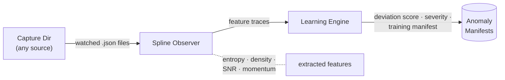

# flow-state

**Entropy-based stream observation and anomaly detection — spline observers with learning engines.**

<p align="center">
  
</p>

*The observer's wall: the stream is invisible, but its temperature is always on dial.*

`flow-state` is a lightweight Python library for monitoring data streams by extracting statistical features (especially Shannon entropy) and flagging anomalies when those features deviate from a rolling baseline.

## How It Works



The same pipeline, step by step:

1. **SplineObserver** watches a directory for incoming JSON files, extracts features (entropy, density, signal-to-noise, momentum), and writes structured trace files.
2. **LearningEngine** consumes those traces, maintains a rolling baseline (mean + std), and emits anomaly manifests when entropy crosses a configurable threshold.

## Use Cases

- **Agent monitoring** — track behavioral entropy of LLM agents, flag unusual patterns
- **Log anomaly detection** — feed log entries as JSON, detect spikes in activity
- **Research capture triage** — prioritize which data captures deserve manual review
- **Content quality scoring** — entropy as a proxy for information density
- **Pipeline health monitoring** — watch any JSON-emitting process for drift

## Install

```bash
pip install -e .
```

## Quick Start

### As a library

```python
from flow_state import SplineObserver, LearningEngine

# Observe a directory — produces trace files
observer = SplineObserver(
    capture_dir="captures/",
    trace_dir="traces/",
    observer_id="my-observer",
)
observer.run_cycle()

# Analyze traces — flags anomalies
engine = LearningEngine(
    trace_dir="traces/",
    manifest_dir="manifests/",
    entropy_threshold=2.0,  # σ multiplier
    rolling_window=50,
)
anomalies = engine.run_cycle()
print(f"Flagged {anomalies} anomalies")
```

### CLI

```bash
# Watch a directory and produce traces (single cycle)
flow-state observe ./captures --trace-dir ./traces --once

# Continuous mode
flow-state observe ./captures --trace-dir ./traces --interval 5

# Analyze traces for anomalies (single cycle)
flow-state analyze ./traces --manifest-dir ./manifests --once

# Continuous mode with custom threshold
flow-state analyze ./traces --manifest-dir ./manifests --threshold 1.5 --interval 10
```

## Configuration

### SplineObserver

| Parameter | Default | Description |
|-----------|---------|-------------|
| `capture_dir` | — | Directory to watch for JSON files |
| `trace_dir` | — | Where to write trace files |
| `observer_id` | `"SplineObserver"` | Identifier included in traces |
| `provenance` | `{}` | Metadata written into each trace |
| `feature_extractor` | built-in | Custom `Callable[[dict], Feature]` override |
| `poll_interval` | `10.0` | Seconds between cycles in continuous mode |

### LearningEngine

| Parameter | Default | Description |
|-----------|---------|-------------|
| `trace_dir` | — | Directory of JSON trace files |
| `manifest_dir` | — | Where to write anomaly manifests |
| `entropy_threshold` | `2.0` | Std-dev multiplier (σ) above mean |
| `rolling_window` | `50` | Max entropy samples for baseline |
| `min_baseline` | `10` | Samples before detection activates |
| `poll_interval` | `10.0` | Seconds between cycles |

## Custom Feature Extraction

```python
from flow_state import SplineObserver, Feature

def my_extractor(data: dict) -> Feature:
    # Your domain-specific feature extraction
    return Feature(
        entropy=calculate_my_entropy(data),
        visual_density=data.get("density", 0),
        signal_noise_ratio=data.get("snr", 0),
        momentum_vector=data.get("momentum", 0),
    )

observer = SplineObserver("captures/", "traces/", feature_extractor=my_extractor)
```

## Data Models

- **`Feature`** — extracted metrics (entropy, density, SNR, momentum)
- **`Trace`** — structured observation record
- **`Anomaly`** — detected anomaly with severity label
- **`Manifest`** — anomaly manifest with training payload

## Development

```bash
pip install -e ".[dev]"
pytest -v
```

## License

MIT
