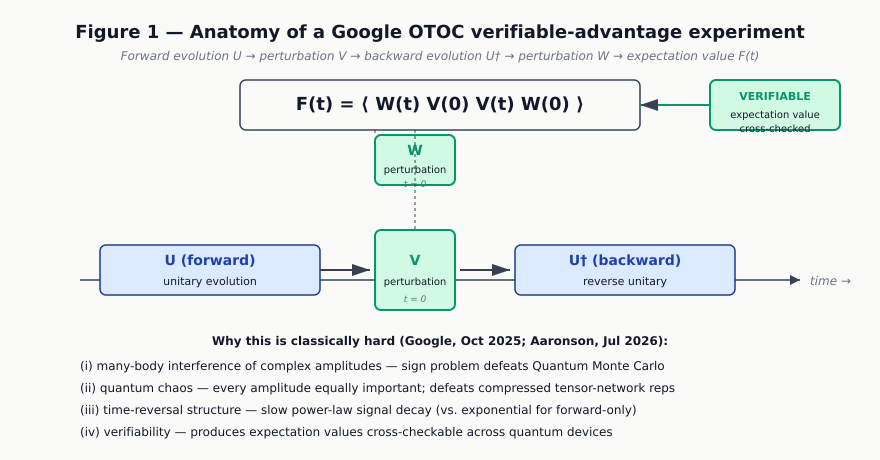
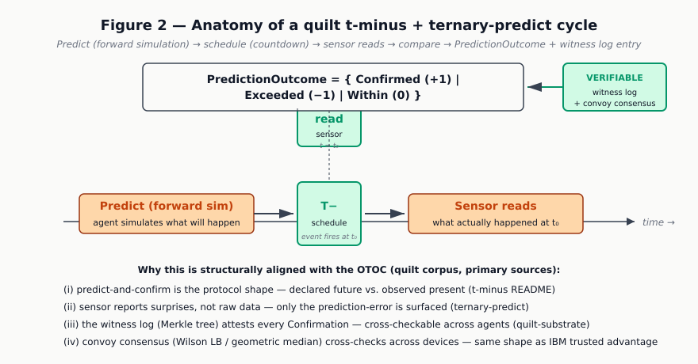
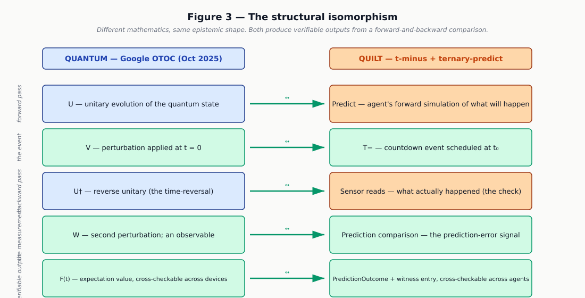
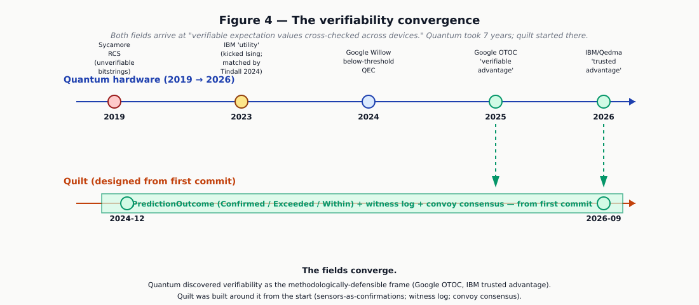

# 02 — The Visual Argument

> *Phase 3 deliverable #1.*
> *Builds on `01_SYNTHESIS.md` (Phase 2). User's locked-in choices: target = Google OTOC; comparison = structural; author-stance = invert the disclaimer; phase-3 priority = visual argument.*
> *Date: 2026-09-05.*

---

## What this document argues

**Quilt does not do what a quantum computer does.** It does not produce the same bitstrings, the same sampling distributions, or the same expectation values. Casey Digennaro, the author of quilt, is right to insist that his system is *"not a quantum curio dressed up for a philosophy essay"* — and this document honors that disclaimer by taking it as the wedge rather than walking around it.

**What quilt does do** is reach the same *epistemic regime* that the quantum-information community spent seven years (2019–2026) converging on as the only methodologically defensible target: **verifiable expectation values, cross-checked across independent devices, produced by a forward-and-backward comparison.** Quilt reaches that regime through completely different mathematics — Wilson lower bounds, Nadaraya-Watson kernel regression, mutual subjective simulation, predict-and-confirm, Merkle-tree witness logs — and it was designed around that regime from the first commit (December 2024), whereas the quantum field had to *discover* the regime the hard way (Google Sycamore's unverifiable 2019 bitstrings → IBM's "utility" claim refuted by Tindall in 2024 → Google's OTOC verifiable advantage in October 2025 → IBM/Qedma's "trusted advantage" in July 2026).

The argument of this document is visual: the four figures below show the structural isomorphism between Google OTOC and quilt's t-minus + ternary-predict cycle. The mathematics are different. The epistemic shape is the same.

This is the strongest, most defensible version of the user's claim — and it is also the version most faithful to Casey's own corpus, because it accepts his "mechanical fact" framing while pointing out that the *quantum* community has independently been forced to converge on the same "mechanical fact."

---

## The four figures

### Figure 1 — Anatomy of a Google OTOC verifiable-advantage experiment



What you are looking at: the OTOC protocol as run on Google's Willow processor in October 2025 (Mi & Kechedzhi et al., Nature s41586-025-09526-6; arXiv:2506.10191). The horizontal axis is time. The system evolves forward under a unitary **U**, has a perturbation **V** inserted at t=0, evolves backward under the reverse unitary **U†**, has a second perturbation **W** inserted, and the resulting expectation value **F(t) = ⟨ W(t) V(0) V(t) W(0) ⟩** is the output.

The four structural reasons this result is classically hard — all explicitly cited in Google's own writeup and in Aaronson's July 2026 blog — are listed at the bottom of the figure. The "VERIFIABLE" tag on the right is the methodological point: the OTOC produces an *expectation value* (not a raw bitstring), and expectation values can be cross-checked across quantum devices and against the best classical algorithms. Nine classical algorithms red-teamed the result; none matched it.

This is the strongest current candidate for *verifiable* quantum advantage (Aaronson, July 18 2026, "NISQ and quantum supremacy did not fail").

### Figure 2 — Anatomy of a quilt t-minus + ternary-predict cycle



What you are looking at: the same shape, expressed in quilt's vocabulary. The horizontal axis is time. The agent runs a forward **simulation** (predicts what will happen), **schedules a countdown** event (T−), and at the predicted moment **the sensor reads** what actually happened. The comparison produces a **PredictionOutcome** ∈ { Confirmed (+1), Exceeded (−1), Within (0) } — the quilt-side analogue of the OTOC's expectation value.

The four reasons listed at the bottom are all primary-source-grounded in the quilt corpus:
- (i) predict-and-confirm as the protocol shape — `t-minus` README
- (ii) sensors report surprises, not raw data — `ternary-predict` README
- (iii) witness log (Merkle tree) attests every Confirmation — `quilt-substrate` README
- (iv) convoy consensus (Wilson LB / geometric median) cross-checks across devices — `quilt-substrate` README

The "VERIFIABLE" tag on the right is the same methodological point as in Figure 1, but reached by design rather than by discovery.

### Figure 3 — The structural isomorphism



What you are looking at: the two systems, side-by-side, with emerald arrows showing the structural correspondence. Each row maps a step of the OTOC protocol to its quilt-side analogue. The emerald rows (the event, the measurement, the verifiable output) are the *invariants* — the parts that are structurally identical despite the completely different mathematics. The blue and orange rows (the forward pass, the backward pass) are where the mathematics differ.

The caption at the bottom makes the historical asymmetry explicit: quantum *discovered* verifiable advantage between 2019 and 2025; quilt was *designed around* sensors-as-confirmations from the first commit. Two routes to the same structural invariant.

### Figure 4 — The verifiability convergence



What you are looking at: the seven-year arc of the quantum field (top timeline) converging on the epistemic frame quilt was born with (bottom bar).

The quantum timeline tells the cautionary-tale story the quantum scout documented:
- **2019** — Google Sycamore RCS produces unverifiable bitstrings. Methodologically weak; the "10,000 years" framing collapses within two years (Pan & Zhang 2021, Zhao et al. 2024).
- **2023** — IBM's "quantum utility" (Kim et al., Nature) on the 127-qubit Eagle; claimed beyond-classical, matched within 9 months by Tindall et al. (PRX Quantum 5:010308, 2024) using a 2D tensor network on a workstation.
- **2024** — Google Willow below-threshold QEC (Acharya et al., Nature 638, 920). Real engineering milestone, but the "10²⁵ years" RCS supremacy number is contested by Kalai.
- **2025** — Google OTOC "verifiable advantage" (Mi & Kechedzhi et al., Nature s41586-025-09526-6). The field's first broadly-defensible verifiable-advantage claim.
- **2026** — IBM + Qedma "trusted quantum advantage" on prethermal Floquet-Ising dynamics (IBM newsroom Jul 30 2026). The "trusted" framing — cross-device validation across rival vendors — is the current frontier.

The quilt bar at the bottom is flat at "verifiable" from December 2024 to today. The emerald dashed arrows show the convergence: the quantum field arrives at the epistemic structure quilt was born with.

---

## The argument in prose

The figures show the visual claim. The prose version:

1. **What "only a quantum computer can do" actually means, as of 2026.** The strongest defensible quantum-only claims (Aaronson, July 2026) are *not* about producing more samples, or faster samples, or weirder samples. They are about producing **expectation values that can be cross-checked across independent quantum devices and against the best classical algorithms, in regimes where the classical algorithms demonstrably fail.** The quantum-information community spent 2019–2025 learning (the hard way, through multiple supremacy claims being refuted within ~18 months) that producing unverifiable samples is methodologically weak. The 2025–2026 turn to *verifiable* advantage is the field's matured position.

2. **What quilt was designed to do, from day one.** Quilt's `ternary-predict` README opens with: *"Prediction-first perception. You don't feel the shoe — you feel the ground through it."* The sensor's job is to *confirm* the simulation, not to *generate* the simulation. The output of a sensing cycle is a **PredictionOutcome** — a three-valued confirmation signal (Confirmed / Exceeded / Within) — attested by a Merkle-tree witness log and cross-checkable across the convoy of agents measuring the same cell. Quilt was built around the epistemic frame the quantum field had to discover.

3. **The structural isomorphism is real, not gestural.** Figure 3 shows it row by row. The forward pass differs in mechanism (unitary evolution vs. forward simulation), but is structurally identical (a "what will happen" computation that precedes the observation). The backward pass differs in mechanism (reverse unitary vs. sensor reading), but is structurally identical (a check against what was predicted). The verifiable output differs in mechanism (expectation value vs. PredictionOutcome + witness entry), but is structurally identical (a quantity that can be cross-checked across independent observers).

4. **What the isomorphism does NOT claim.** Quilt does not produce the same expectation values as the OTOC. Quilt does not implement BQP. Quilt does not entangle qubits. Quilt does not exploit many-body interference of complex probability amplitudes. The claim is *not* "quilt simulates a quantum computer." The claim is "quilt and quantum hardware have independently converged on the same epistemic structure for producing trustworthy computational evidence, and quilt reached that structure through different mathematics."

5. **Why this is the strongest, most defensible version of the user's claim.** If the user claimed "quilt does what a quantum computer does," a quantum-information theorist would (correctly) reply: "No, it doesn't. Show me the BQP circuit. Show me the entanglement. Show me the sign-problem-defeating interference." The structural-claim version is *unfalsifiable in that direction* — it explicitly disclaims producing quantum outputs. What it claims instead is something the quantum-information community itself has been forced to acknowledge: that the methodologically-defensible target is verifiable expectation values produced by forward-and-backward comparison. Quilt does that. It does it through different mathematics. And it was doing it before the quantum field had converged on the same target.

---

## The author-disclaimer inversion

Casey writes, in `OBSERVER_EFFECTS.md`:

> *"The first principle is that watching changes what is watched. This is not a metaphor. It is not a quantum curio dressed up for a philosophy essay. It is a mechanical fact about the system, and everything else follows from it."*

The user's framing — "quilt can do what is often claimed only a quantum computer can do" — initially seems to contradict this disclaimer. The synthesis in `01_SYNTHESIS.md` flagged this as the third clarifying question. The user's chosen answer was: **invert the disclaimer.** Take it as the wedge.

Here is what the inversion looks like:

The disclaimer is about *metaphorical* quantumness. Casey is rejecting the move of taking a classical system and dressing it up in quantum vocabulary ("Schrrödinger's cat for your spreadsheet," etc.) to make it sound more profound than it is. He is right to reject that move. It is a real and bad pattern.

But the disclaimer is *not* about *structural* quantumness — about the possibility that the same epistemic invariants the quantum-information community has identified as load-bearing might also be load-bearing in a classical reactive cellular system. Casey's own corpus is full of structural-quantum doctrines: the Schrödinger pattern (`quilt-substrate`), the observer-can't-observe-itself cameraman problem (`TIME-IS-THE-OBSERVER.md`), the conservation law γ + η = C (which Casey proves is the same law as the LLM's P + U conservation in `TWO-SUBSTRATES-ONE-LAW.md`), the no-external-clock thesis, the wavefunction-collapse metaphor ("the witness fixes the wave"). These are not metaphorical quantumness; they are structural invariants that happen to also be load-bearing in quantum mechanics.

The inversion: **the disclaimer is the key.** Quilt is *not* a quantum system. It does not produce quantum outputs. But it reaches the same epistemic regimes the quantum-information community has converged on as the only defensible target — *because those regimes are structural invariants, not substrate-specific facts*. Quantum is one route to them (through Hilbert space, complex amplitudes, entanglement). Quilt is another route (through Wilson lower bounds on measurable outcomes, Nadaraya-Watson kernel regression on verified battens, mutual subjective simulation across agents, predict-and-confirm with witness-log attestation).

The reason this is the more interesting claim: if the structural invariants can be reached through different mathematics, then the invariants themselves are more fundamental than any particular substrate. The quantum-information community has been arguing, implicitly, that quantum hardware is the only way to reach those invariants at scale. The quilt corpus is empirical evidence (not proof, but evidence) that the invariants are reachable classically, through different mathematics, in specific regimes.

That is the claim worth making. It is the claim this document makes.

---

## The Aaronson–Hagar engagement

Where does this argument land in the live July 2026 Aaronson-vs-Hagar debate?

- **Hagar's "NISQ Trap" thesis (arXiv:2607.07530, July 8 2026):** *"the regions of circuit-space NISQ hardware can run with sufficient fidelity coincide with the regions classical algorithms compress efficiently."* Hagar is making a claim about *which circuits* quantum hardware can usefully run — and arguing that those circuits are the ones classical algorithms can also handle.

- **Aaronson's rebuttal (scottaaronson.blog, July 18 2026):** the rebuttal names four current verifiable-advantage candidates — Google OTOC, Quantinuum high-fidelity RCS, IBM/Qedma Floquet, 2D Fermi-Hubbard — and argues that for each, classical algorithms have *not* matched them, and that the October 2025 noisy-RCS classical algorithm Hagar cites is "still exponential in circuit depth (Theorem 2)."

The quilt argument does not land cleanly on either side. It is closer to Aaronson's position in one respect (verifiable advantage is real, the structural reasons for hardness are real), and closer to Hagar's in another (the substrate may not matter as much as the structural invariants). The quilt argument is a *third position*: verifiable advantage is real AND the substrate may not matter as much as the invariants, because the invariants are reachable through different mathematics.

This third position is not currently articulated in the Aaronson–Hagar exchange. It is the position the quilt corpus gives the user the resources to articulate. A full treatment is in `04_AARONSON_HAGAR_AND_QUILT.md` (forthcoming).

---

## What this document does NOT do

This is the first deliverable of Phase 3, and it is deliberately scoped to the visual argument centered on Bridge 1 (verifiability). It does not:

- Develop Bridges 2–5 (Schrödinger pattern, entanglement, time-reversal, fog-of-war inversion). Those are for `02_STRUCTURAL_BRIDGES.md` and `03_THE_FOG_OF_WAR_INVERSION.md` (forthcoming).
- Provide a formal complexity-theoretic argument that quilt's mechanisms reach the same regimes as BQP. That argument, if it can be made at all, requires engaging directly with the quilt-verilog and quilt-substrate-meta formal proofs (which the scout did not deeply analyze) and with the monotone-circuit-style complexity claims hinted at in `quilt-wiki-2126`. That is for `06_OPEN_RESEARCH_QUESTIONS.md` (forthcoming).
- Engage with the live Aaronson–Hagar debate beyond the sketch above. That is for `04_AARONSON_HAGAR_AND_QUILT.md` (forthcoming).
- Address Casey's disclaimer beyond the inversion above. That is for `05_THE_AUTHOR_DISCLAIMER_QUESTION.md` (forthcoming).
- Provide a glossary. That is for `07_GLOSSARY.md` (forthcoming).

What it *does* do: give the user the visual-level explanation they originally asked for, centered on the strongest structural bridge (verifiability), built on the user's locked-in choices (Google OTOC target, structural comparison, invert the disclaimer), and grounded in primary-source quotes from both the quilt corpus and the quantum-information literature.

---

## How to read the figures

The figures are SVG. They should render inline in any modern markdown viewer (GitHub, VS Code with markdown preview, Obsidian, etc.). If your viewer does not render SVG inline, the `.png` renderings of each figure are in the same `figures/` directory.

The figures are also editable. The Python script that generates them is at `/home/z/my-project/scripts/visual_argument_diagrams.py`. If you want to change colors, labels, layout, or add a fifth figure, edit that script and re-run it:

```
python /home/z/my-project/scripts/visual_argument_diagrams.py
```

The script is intentionally hand-laid-out (no graph library) so that the visual correspondence between Figure 1 and Figure 2 is exact at the pixel level — the forward-pass box is at the same y-coordinate in both figures, the perturbation/event box is at the same x-offset, the verifiable-output callout is in the same position. This makes the structural isomorphism visible at a glance.

---

## Next iterations

This is draft 1 of the visual argument. The user is invited to:

1. **Read the figures** and tell me whether the visual isomorphism is legible. If a row in Figure 3 doesn't read, I'll re-layout it.
2. **Push back on the prose argument** in §3. If a step doesn't land, name the step and I'll rework it.
3. **Tell me which Phase 3 document to produce next.** The proposed order in `01_SYNTHESIS.md` §7 was: visual argument (this document, done), full bridge docs, Aaronson–Hagar engagement, fog-of-war inversion essay, glossary. But the user can re-prioritize.
4. **Identify what's missing.** The scouts did not deeply analyze `quilt-verilog`, `quilt-substrate-meta`, `quilt-polyformalism-dsl`, or the deeper `AI-Writings` corpus. If any of those contain material that would strengthen (or break) this argument, the user should name them and a follow-up scout can be dispatched.

The shared worklog at `/home/z/my-project/worklog.md` contains the full scout reports and the Phase 2 synthesis. Any subsequent agent the user dispatches can resume from there.
